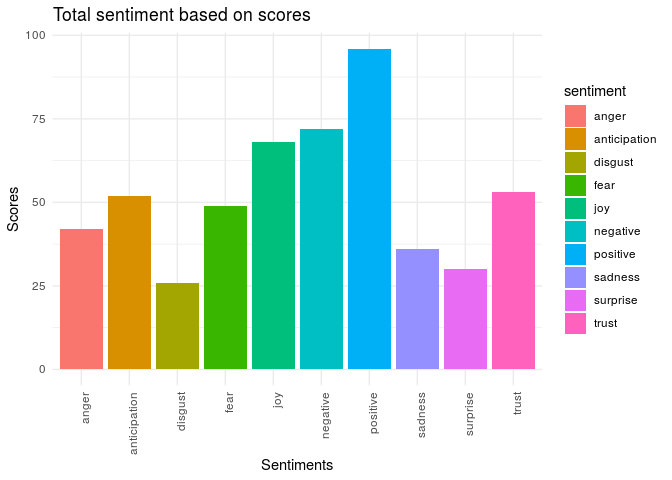

Analysis on Top Radio Songs Trends
================

-----

> **Columns Description**

“Peak.Rank” -\> highest number in the chart the song has peaked.
“Rank.lw” -\> Rank Last Week “Rank.TW” -\> Rank This Week

“Artist” -\> person who sings the song “Title” -\> Name of the song
“Label” -\> companies that market recorded music and corresponding
videos.

“Wks.On” -\>number of weeks the song has been on the Top 40 chart.

BY SPINS “peak” -\>highest number of radio plays the song has gotten
“TW” -\> radio spins this week “LW” -\> radio spins last week “Move”
-\> difference between last week and this week

By DAYPART “OVN” -\> overnight “AMD” -\> early morning  
“MID” -\> mid day  
“PMD” -\> afternoon  
“EVE” -\> evening

“Imp.Mill.” -\> how many people have listened to the song.  
“Imp.LW.Mill.” -\> Impression in last Week “Imp.Move.” -\> impressions
movement “Imp.Rank.” -\> impression rank “Imp.Rank.LW” -\> impression
rank last week

“StationsOn” -\> number of stations a song is on “New.Stations” -\> if
any song is added to new station

BY MARKETS Pop/Adult Contemporary “Top.40” -\> Contemporary hit radio
“AC” -\> Adult contemporary music “Hot.AC” -\> Hot adult contemporary

Rock/Alternative/Indie “Act.Rock” -\> Active Rock “Rock” -\> Rock Music
Market “AAA” -\> Adult album alternative “Alt” -\> Alternative

Urban/Rhythmic “Rhy” -\> Rhythmic  
“Urban” -\> Urban Music Market “Urban.AC” -\> Urban adult contemporary

Country “Country” -\> Country Music Market

Christian/Gospel “Gospel” -\> Gospel Music Market

“Big.Pic” -\> Overall Number oFMarkets

-----

> **Installing and Loading relevant
    packages**

``` r
require(tidyverse)
```

    ## Loading required package: tidyverse

    ## ── Attaching packages ─────────────────────────────────────────────────────────────────────────────── tidyverse 1.2.1 ──

    ## ✔ ggplot2 3.2.1     ✔ purrr   0.3.3
    ## ✔ tibble  2.1.3     ✔ dplyr   0.8.3
    ## ✔ tidyr   1.0.0     ✔ stringr 1.4.0
    ## ✔ readr   1.3.1     ✔ forcats 0.4.0

    ## ── Conflicts ────────────────────────────────────────────────────────────────────────────────── tidyverse_conflicts() ──
    ## ✖ dplyr::filter() masks stats::filter()
    ## ✖ dplyr::lag()    masks stats::lag()

``` r
require(dplyr)
install.packages("tidyr")
```

    ## Installing package into '/home/rstudio-user/R/x86_64-pc-linux-gnu-library/3.6'
    ## (as 'lib' is unspecified)

``` r
library(tidyr)

install.packages("reshape2")
```

    ## Installing package into '/home/rstudio-user/R/x86_64-pc-linux-gnu-library/3.6'
    ## (as 'lib' is unspecified)

``` r
library(reshape2)
```

    ## 
    ## Attaching package: 'reshape2'

    ## The following object is masked from 'package:tidyr':
    ## 
    ##     smiths

``` r
install.packages("ggplot2")
```

    ## Installing package into '/home/rstudio-user/R/x86_64-pc-linux-gnu-library/3.6'
    ## (as 'lib' is unspecified)

``` r
library(ggplot2)
install.packages("ggalt")
```

    ## Installing package into '/home/rstudio-user/R/x86_64-pc-linux-gnu-library/3.6'
    ## (as 'lib' is unspecified)

``` r
library(ggalt)
```

    ## Registered S3 methods overwritten by 'ggalt':
    ##   method                  from   
    ##   grid.draw.absoluteGrob  ggplot2
    ##   grobHeight.absoluteGrob ggplot2
    ##   grobWidth.absoluteGrob  ggplot2
    ##   grobX.absoluteGrob      ggplot2
    ##   grobY.absoluteGrob      ggplot2

``` r
install.packages("Rmisc")
```

    ## Installing package into '/home/rstudio-user/R/x86_64-pc-linux-gnu-library/3.6'
    ## (as 'lib' is unspecified)

``` r
library(Rmisc)  # for multiplot
```

    ## Loading required package: lattice

    ## Loading required package: plyr

    ## ------------------------------------------------------------------------------

    ## You have loaded plyr after dplyr - this is likely to cause problems.
    ## If you need functions from both plyr and dplyr, please load plyr first, then dplyr:
    ## library(plyr); library(dplyr)

    ## ------------------------------------------------------------------------------

    ## 
    ## Attaching package: 'plyr'

    ## The following objects are masked from 'package:dplyr':
    ## 
    ##     arrange, count, desc, failwith, id, mutate, rename, summarise,
    ##     summarize

    ## The following object is masked from 'package:purrr':
    ## 
    ##     compact

``` r
install.packages("corrplot")
```

    ## Installing package into '/home/rstudio-user/R/x86_64-pc-linux-gnu-library/3.6'
    ## (as 'lib' is unspecified)

``` r
library(corrplot)
```

    ## corrplot 0.84 loaded

``` r
# for sentiment analysis
install.packages("syuzhet")
```

    ## Installing package into '/home/rstudio-user/R/x86_64-pc-linux-gnu-library/3.6'
    ## (as 'lib' is unspecified)

``` r
library(syuzhet)
install.packages("tidytext")
```

    ## Installing package into '/home/rstudio-user/R/x86_64-pc-linux-gnu-library/3.6'
    ## (as 'lib' is unspecified)

``` r
library(tidytext)
install.packages("textdata")
```

    ## Installing package into '/home/rstudio-user/R/x86_64-pc-linux-gnu-library/3.6'
    ## (as 'lib' is unspecified)

``` r
library(textdata)
```

# 1\. **Data Analysis and Cleaning**

> **Loading our datasets**

``` r
m7 <- read.csv("mediabase nov 7.csv", encoding = "UTF-8")
m11 <- read.csv("Mediabase nov 11.csv", encoding = "UTF-8") 
```

> **Columns**

``` r
colnames(m7)
```

    ##  [1] "Peak.Rank"    "Rank.lw"      "Rank.TW"      "Artist"       "Title"       
    ##  [6] "Label"        "Wks.On"       "Peak"         "TW"           "LW"          
    ## [11] "Move"         "OVN"          "AMD"          "MID"          "PMD"         
    ## [16] "EVE"          "Imp.Mill."    "Imp.LW.Mill." "Imp.Move."    "Imp.Rank."   
    ## [21] "Imp.Rank.LW"  "StationsOn"   "New.Stations" "Big.Pic"      "Top.40"      
    ## [26] "Rhy"          "Urban"        "Urban.AC"     "Rock"         "AAA"         
    ## [31] "Alt"          "Act.Rock"     "AC"           "Hot.AC"       "Country"     
    ## [36] "Gospel"

``` r
dim(m7)
```

    ## [1] 500  36

``` r
dim(m11)
```

    ## [1] 500  36

  - There are 36 columns in both datasets with similar column names

<!-- end list -->

``` r
# viewing a sample from our datasets
head(m7, 5)
```

<div data-pagedtable="false">

<script data-pagedtable-source type="application/json">
{"columns":[{"label":[""],"name":["_rn_"],"type":[""],"align":["left"]},{"label":["Peak.Rank"],"name":[1],"type":["int"],"align":["right"]},{"label":["Rank.lw"],"name":[2],"type":["fctr"],"align":["left"]},{"label":["Rank.TW"],"name":[3],"type":["int"],"align":["right"]},{"label":["Artist"],"name":[4],"type":["fctr"],"align":["left"]},{"label":["Title"],"name":[5],"type":["fctr"],"align":["left"]},{"label":["Label"],"name":[6],"type":["fctr"],"align":["left"]},{"label":["Wks.On"],"name":[7],"type":["fctr"],"align":["left"]},{"label":["Peak"],"name":[8],"type":["int"],"align":["right"]},{"label":["TW"],"name":[9],"type":["int"],"align":["right"]},{"label":["LW"],"name":[10],"type":["int"],"align":["right"]},{"label":["Move"],"name":[11],"type":["int"],"align":["right"]},{"label":["OVN"],"name":[12],"type":["int"],"align":["right"]},{"label":["AMD"],"name":[13],"type":["int"],"align":["right"]},{"label":["MID"],"name":[14],"type":["int"],"align":["right"]},{"label":["PMD"],"name":[15],"type":["int"],"align":["right"]},{"label":["EVE"],"name":[16],"type":["int"],"align":["right"]},{"label":["Imp.Mill."],"name":[17],"type":["dbl"],"align":["right"]},{"label":["Imp.LW.Mill."],"name":[18],"type":["dbl"],"align":["right"]},{"label":["Imp.Move."],"name":[19],"type":["dbl"],"align":["right"]},{"label":["Imp.Rank."],"name":[20],"type":["int"],"align":["right"]},{"label":["Imp.Rank.LW"],"name":[21],"type":["int"],"align":["right"]},{"label":["StationsOn"],"name":[22],"type":["int"],"align":["right"]},{"label":["New.Stations"],"name":[23],"type":["int"],"align":["right"]},{"label":["Big.Pic"],"name":[24],"type":["int"],"align":["right"]},{"label":["Top.40"],"name":[25],"type":["int"],"align":["right"]},{"label":["Rhy"],"name":[26],"type":["int"],"align":["right"]},{"label":["Urban"],"name":[27],"type":["int"],"align":["right"]},{"label":["Urban.AC"],"name":[28],"type":["int"],"align":["right"]},{"label":["Rock"],"name":[29],"type":["int"],"align":["right"]},{"label":["AAA"],"name":[30],"type":["int"],"align":["right"]},{"label":["Alt"],"name":[31],"type":["int"],"align":["right"]},{"label":["Act.Rock"],"name":[32],"type":["int"],"align":["right"]},{"label":["AC"],"name":[33],"type":["int"],"align":["right"]},{"label":["Hot.AC"],"name":[34],"type":["int"],"align":["right"]},{"label":["Country"],"name":[35],"type":["int"],"align":["right"]},{"label":["Gospel"],"name":[36],"type":["int"],"align":["right"]}],"data":[{"1":"1","2":"1","3":"1","4":"CAPALDI, LEWIS","5":"Someone You Loved","6":"Vertigo/Capitol","7":"22","8":"19038","9":"17742","10":"18792","11":"-1050","12":"4567","13":"2238","14":"4009","15":"3225","16":"3703","17":"82.528","18":"87.806","19":"-5.278","20":"1","21":"1","22":"187","23":"0","24":"2","25":"1","26":"214","27":"2215","28":"0","29":"0","30":"43","31":"1249","32":"0","33":"6","34":"1","35":"0","36":"0","_rn_":"1"},{"1":"2","2":"4","3":"2","4":"POST MALONE","5":"Circles","6":"Republic","7":"10","8":"16436","9":"16436","10":"15403","11":"1033","12":"4256","13":"1983","14":"3578","15":"2871","16":"3748","17":"76.684","18":"70.919","19":"5.765","20":"3","21":"4","22":"186","23":"0","24":"4","25":"2","26":"17","27":"153","28":"0","29":"0","30":"0","31":"37","32":"0","33":"36","34":"12","35":"0","36":"0","_rn_":"2"},{"1":"1","2":"2","3":"3","4":"LIZZO","5":"Truth Hurts","6":"Nice Life/Atlantic","7":"23","8":"20012","9":"16238","10":"17440","11":"-1202","12":"4082","13":"2047","14":"3605","15":"2958","16":"3546","17":"80.783","18":"86.200","19":"-5.417","20":"2","21":"2","22":"185","23":"0","24":"1","25":"3","26":"4","27":"8","28":"35","29":"0","30":"526","31":"0","32":"0","33":"0","34":"10","35":"531","36":"0","_rn_":"3"},{"1":"4","2":"5","3":"4","4":"JONAS BROTHERS","5":"Only Human","6":"Republic","7":"18","8":"15573","9":"15573","10":"14317","11":"1256","12":"4130","13":"1894","14":"3371","15":"2696","16":"3482","17":"69.542","18":"65.177","19":"4.365","20":"5","21":"6","22":"186","23":"0","24":"5","25":"4","26":"61","27":"0","28":"0","29":"0","30":"0","31":"0","32":"0","33":"30","34":"5","35":"0","36":"0","_rn_":"4"},{"1":"1","2":"3","3":"5","4":"MENDES, SHAWN/CABELLO, CAMILA","5":"Senorita","6":"Island/Epic-Republic","7":"19","8":"19800","9":"14832","10":"16572","11":"-1740","12":"3762","13":"1861","14":"3315","15":"2709","16":"3185","17":"71.913","18":"81.025","19":"-9.112","20":"4","21":"3","22":"185","23":"0","24":"3","25":"5","26":"27","27":"0","28":"0","29":"0","30":"0","31":"838","32":"0","33":"7","34":"2","35":"0","36":"0","_rn_":"5"}],"options":{"columns":{"min":{},"max":[10]},"rows":{"min":[10],"max":[10]},"pages":{}}}
  </script>

</div>

``` r
head(m11, 5)
```

<div data-pagedtable="false">

<script data-pagedtable-source type="application/json">
{"columns":[{"label":[""],"name":["_rn_"],"type":[""],"align":["left"]},{"label":["Peak.Rank"],"name":[1],"type":["int"],"align":["right"]},{"label":["Rank.lw"],"name":[2],"type":["fctr"],"align":["left"]},{"label":["Rank.TW"],"name":[3],"type":["int"],"align":["right"]},{"label":["Artist"],"name":[4],"type":["fctr"],"align":["left"]},{"label":["Title"],"name":[5],"type":["fctr"],"align":["left"]},{"label":["Label"],"name":[6],"type":["fctr"],"align":["left"]},{"label":["Wks.On"],"name":[7],"type":["fctr"],"align":["left"]},{"label":["Peak"],"name":[8],"type":["int"],"align":["right"]},{"label":["TW"],"name":[9],"type":["int"],"align":["right"]},{"label":["LW"],"name":[10],"type":["int"],"align":["right"]},{"label":["Move"],"name":[11],"type":["int"],"align":["right"]},{"label":["OVN"],"name":[12],"type":["int"],"align":["right"]},{"label":["AMD"],"name":[13],"type":["int"],"align":["right"]},{"label":["MID"],"name":[14],"type":["int"],"align":["right"]},{"label":["PMD"],"name":[15],"type":["int"],"align":["right"]},{"label":["EVE"],"name":[16],"type":["int"],"align":["right"]},{"label":["Imp.Mill."],"name":[17],"type":["dbl"],"align":["right"]},{"label":["Imp.LW.Mill."],"name":[18],"type":["dbl"],"align":["right"]},{"label":["Imp.Move."],"name":[19],"type":["dbl"],"align":["right"]},{"label":["Imp.Rank."],"name":[20],"type":["int"],"align":["right"]},{"label":["Imp.Rank.LW"],"name":[21],"type":["int"],"align":["right"]},{"label":["StationsOn"],"name":[22],"type":["int"],"align":["right"]},{"label":["New.Stations"],"name":[23],"type":["int"],"align":["right"]},{"label":["Big.Pic"],"name":[24],"type":["int"],"align":["right"]},{"label":["Top.40"],"name":[25],"type":["int"],"align":["right"]},{"label":["Rhy"],"name":[26],"type":["int"],"align":["right"]},{"label":["Urban"],"name":[27],"type":["int"],"align":["right"]},{"label":["Urban.AC"],"name":[28],"type":["int"],"align":["right"]},{"label":["Rock"],"name":[29],"type":["int"],"align":["right"]},{"label":["AAA"],"name":[30],"type":["int"],"align":["right"]},{"label":["Alt"],"name":[31],"type":["int"],"align":["right"]},{"label":["Act.Rock"],"name":[32],"type":["int"],"align":["right"]},{"label":["AC"],"name":[33],"type":["int"],"align":["right"]},{"label":["Hot.AC"],"name":[34],"type":["int"],"align":["right"]},{"label":["Country"],"name":[35],"type":["int"],"align":["right"]},{"label":["Gospel"],"name":[36],"type":["int"],"align":["right"]}],"data":[{"1":"1","2":"1","3":"1","4":"CAPALDI, LEWIS","5":"Someone You Loved","6":"Vertigo/Capitol","7":"23","8":"19038","9":"17296","10":"17742","11":"-446","12":"4509","13":"2212","14":"3880","15":"3110","16":"3585","17":"81.776","18":"82.528","19":"-0.752","20":"1","21":"1","22":"186","23":"0","24":"1","25":"1","26":"313","27":"2110","28":"0","29":"0","30":"39","31":"358","32":"0","33":"5","34":"2","35":"0","36":"0","_rn_":"1"},{"1":"2","2":"2","3":"2","4":"POST MALONE","5":"Circles","6":"Republic","7":"11","8":"17153","9":"17153","10":"16439","11":"714","12":"4485","13":"2102","14":"3710","15":"3007","16":"3849","17":"79.989","18":"76.687","19":"3.302","20":"2","21":"3","22":"186","23":"0","24":"3","25":"2","26":"15","27":"148","28":"0","29":"0","30":"0","31":"33","32":"0","33":"32","34":"12","35":"0","36":"0","_rn_":"2"},{"1":"3","2":"4","3":"3","4":"JONAS BROTHERS","5":"Only Human","6":"Republic","7":"19","8":"15954","9":"15954","10":"15573","11":"381","12":"4339","13":"1943","14":"3443","15":"2745","16":"3484","17":"71.373","18":"69.542","19":"1.831","20":"5","21":"5","22":"186","23":"0","24":"5","25":"3","26":"58","27":"0","28":"0","29":"0","30":"0","31":"0","32":"0","33":"28","34":"6","35":"0","36":"0","_rn_":"3"},{"1":"4","2":"7","3":"4","4":"LIZZO","5":"Good As Hell","6":"Nice Life/Atlantic","7":"9","8":"15421","9":"15421","10":"13290","11":"2131","12":"3993","13":"1877","14":"3370","15":"2762","16":"3419","17":"78.619","18":"68.823","19":"9.796","20":"3","21":"6","22":"186","23":"0","24":"7","25":"4","26":"12","27":"140","28":"1117","29":"0","30":"1502","31":"0","32":"0","33":"56","34":"24","35":"0","36":"0","_rn_":"4"},{"1":"5","2":"6","3":"5","4":"SHEERAN, ED","5":"Beautiful People f/Khalid","6":"RCA-Atlantic","7":"19","8":"15172","9":"15172","10":"14773","11":"399","12":"4055","13":"1862","14":"3276","15":"2630","16":"3349","17":"67.644","18":"66.737","19":"0.907","20":"6","21":"7","22":"186","23":"0","24":"6","25":"5","26":"49","27":"0","28":"897","29":"0","30":"0","31":"0","32":"0","33":"20","34":"8","35":"0","36":"0","_rn_":"5"}],"options":{"columns":{"min":{},"max":[10]},"rows":{"min":[10],"max":[10]},"pages":{}}}
  </script>

</div>

> **Structure of the Data**

``` r
str(m7)
```

    ## 'data.frame':    500 obs. of  36 variables:
    ##  $ Peak.Rank   : int  1 2 1 4 1 6 7 7 9 1 ...
    ##  $ Rank.lw     : Factor w/ 446 levels "---------","1",..: 2 292 121 329 219 369 405 383 21 3 ...
    ##  $ Rank.TW     : int  1 2 3 4 5 6 7 8 9 10 ...
    ##  $ Artist      : Factor w/ 411 levels "2 CHAINZ","21 SAVAGE",..: 61 293 220 179 249 334 220 332 343 335 ...
    ##  $ Title       : Factor w/ 497 levels "10,000 Hours",..: 392 89 451 326 379 45 162 447 193 200 ...
    ##  $ Label       : Factor w/ 240 levels "---","10 Summers/Interscope",..: 215 177 148 177 113 169 148 159 44 59 ...
    ##  $ Wks.On      : Factor w/ 22 levels "--","1","10",..: 13 3 14 10 11 10 21 13 8 15 ...
    ##  $ Peak        : int  19038 16436 20012 15573 19800 14773 13290 12993 9780 19279 ...
    ##  $ TW          : int  17742 16436 16238 15573 14832 14773 13290 12993 9780 9424 ...
    ##  $ LW          : int  18792 15403 17440 14317 16572 14179 10937 12131 9237 10367 ...
    ##  $ Move        : int  -1050 1033 -1202 1256 -1740 594 2353 862 543 -943 ...
    ##  $ OVN         : int  4567 4256 4082 4130 3762 3906 3424 3426 2688 2315 ...
    ##  $ AMD         : int  2238 1983 2047 1894 1861 1823 1567 1598 1070 1118 ...
    ##  $ MID         : int  4009 3578 3605 3371 3315 3164 2897 2903 2156 2175 ...
    ##  $ PMD         : int  3225 2871 2958 2696 2709 2600 2405 2327 1693 1731 ...
    ##  $ EVE         : int  3703 3748 3546 3482 3185 3280 2997 2739 2173 2085 ...
    ##  $ Imp.Mill.   : num  82.5 76.7 80.8 69.5 71.9 ...
    ##  $ Imp.LW.Mill.: num  87.8 70.9 86.2 65.2 81 ...
    ##  $ Imp.Move.   : num  -5.28 5.76 -5.42 4.37 -9.11 ...
    ##  $ Imp.Rank.   : int  1 3 2 5 4 7 6 8 9 10 ...
    ##  $ Imp.Rank.LW : int  1 4 2 6 3 5 7 8 11 9 ...
    ##  $ StationsOn  : int  187 186 185 186 185 186 186 187 186 186 ...
    ##  $ New.Stations: int  0 0 0 0 0 0 0 1 0 0 ...
    ##  $ Big.Pic     : int  2 4 1 5 3 6 9 7 15 8 ...
    ##  $ Top.40      : int  1 2 3 4 5 6 7 8 9 10 ...
    ##  $ Rhy         : int  214 17 4 61 27 48 15 171 82 0 ...
    ##  $ Urban       : int  2215 153 8 0 0 0 141 2014 0 928 ...
    ##  $ Urban.AC    : int  0 0 35 0 0 0 512 0 0 524 ...
    ##  $ Rock        : int  0 0 0 0 0 0 0 0 0 0 ...
    ##  $ AAA         : int  43 0 526 0 0 0 377 0 0 126 ...
    ##  $ Alt         : int  1249 37 0 0 838 0 0 10 0 848 ...
    ##  $ Act.Rock    : int  0 0 0 0 0 0 0 543 0 0 ...
    ##  $ AC          : int  6 36 0 30 7 20 60 23 27 3 ...
    ##  $ Hot.AC      : int  1 12 10 5 2 8 30 11 15 4 ...
    ##  $ Country     : int  0 0 531 0 0 0 0 0 0 0 ...
    ##  $ Gospel      : int  0 0 0 0 0 0 0 0 0 0 ...

  - Looking at the structure of our dataset, we can see that
      - there are certain missing values denoted with hyphens(-), and it
        needs to be replaced or dropped
      - certain columns have incorrect data types, that needs to be
        changed

> **Correct the Data Types**

``` r
m7$Rank.lw <- as.integer(as.character(m7$Rank.lw))
```

    ## Warning: NAs introduced by coercion

``` r
m7$Wks.On <- as.integer(as.character(m7$Wks.On))
```

    ## Warning: NAs introduced by coercion

``` r
m11$Rank.lw <- as.integer(as.character(m11$Rank.lw))
```

    ## Warning: NAs introduced by coercion

``` r
m11$Wks.On <- as.integer(as.character(m11$Wks.On))
```

    ## Warning: NAs introduced by coercion

  - The missing values in Rank.lw and Wks.On has been replaced with NA.

> **Let’s first replace NA’s and hyphens**

  - From a general understanding its clearly evident that the hyphen are
    replaced with NA data points in ‘Rank.lw’ and ‘Wks.On’. We will
    replace them with 0.
  - And for Label hyphen should be Unknown as we dont want to drop our
    rows here

<!-- end list -->

``` r
m7$Rank.lw[is.na(m7$Rank.lw)] <- 0
m7$Wks.On[is.na(m7$Wks.On)] <- 0

m11$Rank.lw[is.na(m11$Rank.lw)] <- 0
m11$Wks.On[is.na(m11$Wks.On)] <- 0

m7$Label <- gsub('---', "Unknown", m7$Label) # replace hyphens in Label with Unknown
m11$Label <- gsub('---', "Unknown", m11$Label) # replace hyphens in Label with Unknown
```

# 2\. **Descriptive Statistics**

  - Summary of a data gives us the detailed information of all the
    variables.

<!-- end list -->

``` r
summary(m7)
```

    ##    Peak.Rank        Rank.lw           Rank.TW                 Artist   
    ##  Min.   :  1.0   Min.   :   0.00   Min.   :  1.0   DABABY        :  6  
    ##  1st Qu.: 65.0   1st Qu.:  71.75   1st Qu.:125.8   POST MALONE   :  6  
    ##  Median :119.5   Median : 205.50   Median :250.5   BROWN, CHRIS  :  5  
    ##  Mean   :159.7   Mean   : 276.76   Mean   :255.2   EILISH, BILLIE:  4  
    ##  3rd Qu.:224.8   3rd Qu.: 363.75   3rd Qu.:375.2   MALUMA        :  4  
    ##  Max.   :500.0   Max.   :1420.00   Max.   :541.0   MUSTARD       :  4  
    ##                                                    (Other)       :471  
    ##                             Title        Label               Wks.On      
    ##  Joy                           :  2   Length:500         Min.   : 0.000  
    ##  Miss Me More                  :  2   Class :character   1st Qu.: 0.000  
    ##  Wanted                        :  2   Mode  :character   Median : 0.000  
    ##  10,000 Hours                  :  1                      Mean   : 0.816  
    ##  100 Bands f/Quavo/21 Savage...:  1                      3rd Qu.: 0.000  
    ##  11:00 PM                      :  1                      Max.   :26.000  
    ##  (Other)                       :491                                      
    ##       Peak               TW                 LW                Move         
    ##  Min.   :    2.0   Min.   :    2.00   Min.   :    0.00   Min.   :-3358.00  
    ##  1st Qu.:   10.0   1st Qu.:    3.00   1st Qu.:    2.00   1st Qu.:   -1.00  
    ##  Median :   45.0   Median :    7.00   Median :    6.00   Median :    1.00  
    ##  Mean   :  704.3   Mean   :  562.05   Mean   :  544.11   Mean   :   17.94  
    ##  3rd Qu.:  179.2   3rd Qu.:   29.25   3rd Qu.:   32.25   3rd Qu.:    3.00  
    ##  Max.   :20012.0   Max.   :17742.00   Max.   :18792.00   Max.   : 2737.00  
    ##                                                                            
    ##       OVN              AMD               MID              PMD         
    ##  Min.   :   0.0   Min.   :   0.00   Min.   :   0.0   Min.   :   0.00  
    ##  1st Qu.:   1.0   1st Qu.:   0.00   1st Qu.:   0.0   1st Qu.:   0.00  
    ##  Median :   3.0   Median :   0.00   Median :   0.0   Median :   1.00  
    ##  Mean   : 168.3   Mean   :  59.52   Mean   : 109.4   Mean   :  92.14  
    ##  3rd Qu.:  11.0   3rd Qu.:   3.00   3rd Qu.:   5.0   3rd Qu.:   4.00  
    ##  Max.   :4567.0   Max.   :2238.00   Max.   :4009.0   Max.   :3225.00  
    ##                                                                       
    ##       EVE           Imp.Mill.         Imp.LW.Mill.      Imp.Move.        
    ##  Min.   :   0.0   Min.   : 0.00000   Min.   : 0.000   Min.   :-11.62900  
    ##  1st Qu.:   1.0   1st Qu.: 0.00300   1st Qu.: 0.001   1st Qu.: -0.00200  
    ##  Median :   3.0   Median : 0.00900   Median : 0.008   Median :  0.00100  
    ##  Mean   : 132.7   Mean   : 2.36893   Mean   : 2.287   Mean   :  0.08169  
    ##  3rd Qu.:   9.0   3rd Qu.: 0.06025   3rd Qu.: 0.058   3rd Qu.:  0.00625  
    ##  Max.   :3748.0   Max.   :82.52800   Max.   :87.806   Max.   : 13.81200  
    ##                                                                          
    ##    Imp.Rank.      Imp.Rank.LW      StationsOn      New.Stations   
    ##  Min.   :  1.0   Min.   :  1.0   Min.   :  1.00   Min.   :  0.00  
    ##  1st Qu.:127.8   1st Qu.:128.8   1st Qu.:  1.00   1st Qu.:  0.00  
    ##  Median :305.0   Median :302.5   Median :  3.00   Median :  1.00  
    ##  Mean   :389.8   Mean   :371.6   Mean   : 20.00   Mean   :  2.66  
    ##  3rd Qu.:608.2   3rd Qu.:577.2   3rd Qu.:  7.25   3rd Qu.:  2.00  
    ##  Max.   :983.0   Max.   :983.0   Max.   :187.00   Max.   :140.00  
    ##                                                                   
    ##     Big.Pic           Top.40           Rhy             Urban       
    ##  Min.   :   0.0   Min.   :  1.0   Min.   :   0.0   Min.   :   0.0  
    ##  1st Qu.:   0.0   1st Qu.:125.8   1st Qu.:   0.0   1st Qu.:   0.0  
    ##  Median :   0.0   Median :250.5   Median :   0.0   Median :   0.0  
    ##  Mean   : 297.8   Mean   :255.2   Mean   : 219.3   Mean   : 123.7  
    ##  3rd Qu.: 244.5   3rd Qu.:375.2   3rd Qu.: 184.5   3rd Qu.:   0.0  
    ##  Max.   :2588.0   Max.   :541.0   Max.   :1670.0   Max.   :2944.0  
    ##                                                                    
    ##     Urban.AC            Rock        AAA               Alt         
    ##  Min.   :   0.00   Min.   :0   Min.   :   0.00   Min.   :   0.00  
    ##  1st Qu.:   0.00   1st Qu.:0   1st Qu.:   0.00   1st Qu.:   0.00  
    ##  Median :   0.00   Median :0   Median :   0.00   Median :   0.00  
    ##  Mean   :  83.04   Mean   :0   Mean   :  30.05   Mean   :  31.94  
    ##  3rd Qu.:   0.00   3rd Qu.:0   3rd Qu.:   0.00   3rd Qu.:   0.00  
    ##  Max.   :1535.00   Max.   :0   Max.   :2030.00   Max.   :1742.00  
    ##                                                                   
    ##     Act.Rock             AC              Hot.AC          Country       
    ##  Min.   :  0.000   Min.   :  0.000   Min.   :  0.00   Min.   :  0.000  
    ##  1st Qu.:  0.000   1st Qu.:  0.000   1st Qu.:  0.00   1st Qu.:  0.000  
    ##  Median :  0.000   Median :  0.000   Median :  0.00   Median :  0.000  
    ##  Mean   :  5.756   Mean   :  6.632   Mean   : 21.42   Mean   :  2.122  
    ##  3rd Qu.:  0.000   3rd Qu.:  0.000   3rd Qu.:  0.00   3rd Qu.:  0.000  
    ##  Max.   :544.000   Max.   :287.000   Max.   :348.00   Max.   :531.000  
    ##                                                                        
    ##      Gospel       
    ##  Min.   :  0.000  
    ##  1st Qu.:  0.000  
    ##  Median :  0.000  
    ##  Mean   :  9.152  
    ##  3rd Qu.:  0.000  
    ##  Max.   :775.000  
    ## 

  - Box plot on “Peak Rank” “Rank.Tw”,
“Rank.Lw”

<!-- end list -->

``` r
ggplot(data = melt(m7[c(1:3)], id.vars = NULL), aes(x=variable, y=value)) + geom_boxplot(aes(fill=variable), outlier.alpha = 0.1) + theme(legend.position="none") + coord_flip()
```

<!-- -->

  - Box plot on “Weeks
On”

<!-- end list -->

``` r
ggplot(data = melt(log(m7[c(7)]), id.vars = NULL), aes(x=variable, y=value)) + geom_boxplot(aes(fill=variable), outlier.alpha = 0.1) + theme(legend.position="none") + coord_flip()
```

    ## Warning: Removed 460 rows containing non-finite values (stat_boxplot).

<!-- -->

  - Box plot on spins i.e, “Peak”, “This Week”, “Last
Week”

<!-- end list -->

``` r
ggplot(data = melt(log(m7[,c(8:10)]), id.vars = NULL), aes(x = variable, y=value)) + geom_boxplot(aes(fill = variable), outlier.alpha = 0.1) + theme(legend.position = "none") 
```

    ## Warning: Removed 67 rows containing non-finite values (stat_boxplot).

<!-- -->

  - Box plot by daypart i.e, “OVN”, “am”, “mid”, “pm”,
“eve”

<!-- end list -->

``` r
ggplot(data = melt(log(m7[,c(12:16)]), id.vars = NULL), aes(x = variable, y = value)) + geom_boxplot(aes(fill = variable), outlier.alpha = 0.1) + theme(legend.position = "none")
```

    ## Warning: Removed 1017 rows containing non-finite values (stat_boxplot).

<!-- -->

  - Box plot by
“Format-By-Format-rank”

<!-- end list -->

``` r
ggplot(data = melt(log(m7[c(24:36)]), id.vars = NULL), aes(x = variable, y=value)) + geom_boxplot(aes(fill = variable)) + theme(legend.position = "none")
```

    ## Warning: Removed 5186 rows containing non-finite values (stat_boxplot).

<!-- -->

> **Correlation between columns**

``` r
m7_num <- m7[, -(4:6)] # include every column except 4th, 5th, and 6th

m7_num$Wks.On <- gsub('--', 0, m7_num$Wks.On) # changing hypens to 0
m7_num$Rank.lw <- gsub('--', 0, m7_num$Rank.lw) # changing hypens to 0

m7_num <- as.data.frame(sapply( m7_num, as.numeric)) # converting all columns to numeric type

m7Cor <- cor(m7_num)
```

    ## Warning in cor(m7_num): the standard deviation is zero

``` r
corrplot(m7Cor,  type = "upper", method = "ellipse", tl.srt = 90, tl.cex = 0.7, tl.col = "red", na.label = ".")
```

<!-- -->

  - this plot gives us a correlation between numerical columns, dark
    blue is higl positive correlation, dark red high negative
    correlation
  - Consider Wks.On, it is highly dependent on Peak, TW, LW, Imp.Mill,
    StationsOn etc
  - Rank.TW is having high negative corelation with StationsOn

> **Relation between StationsOn and Rank This Week**

``` r
ggplot(m11, aes(StationsOn, Rank.TW)) + geom_point() + 
  geom_count(col="tomato3", show.legend = F)   +
  labs(y = "Rank", 
       x = "StationsOn", 
       title = "Relation between StationsOn and Rank This Week")
```

<!-- -->

  - This scatterplot depicts that the better the Rank higher the Number
    of Stations

> **Labels Relation to Peak
Votes**

``` r
ggplot(head(m11, 20), aes(Label, Peak)) + geom_boxplot(varwidth = T, fill = "plum") + 
    labs(title="Box plot : Peak Votes grouped by Labels for top 20 songs Nov11",
         x = "Labels", y = "Total Peak Votes") +
theme(axis.text.x = element_text(angle = 90, hjust = 1))
```

<!-- -->

# 3\. **Exploratory Analysis**

> **Visualizing Rank change for top 20 songs between nov7 vs nov11**

``` r
m11_top20 <- head(m11, 20)
m11_top20$Title <- factor(m11_top20$Title, levels=as.character(m11_top20$Title))  # for right ordering of the dumbells

gg <- ggplot(m11_top20,aes(x = Rank.lw, xend = Rank.TW, y = Title, group = Title)) + 
        geom_dumbbell(color = "#a3c4dc", 
                      colour_x = "red",
                      colour_xend = "darkBlue",
                      size = 0.95) +
        labs(x = NULL, 
             y = NULL, 
             title = "Dumbbell Chart : Rank Change between Nov7 to Nov11 for Top 20 Songs") +
        theme(plot.title = element_text(hjust = 0.5, face = "bold"),
              plot.background = element_rect(fill = "#f7f7f7"),
              panel.background = element_rect(fill = "#f7f7f7"),
              panel.grid.minor = element_blank(),
              panel.grid.major.y = element_blank(),
              panel.grid.major.x = element_line(),
              axis.ticks = element_blank(),
              legend.position = "top",
              panel.border = element_blank())
plot(gg)
```

<!-- -->

  - Orange dots depict Nov7 Week, Blue depict Nov11 week.

> **Wks.On vs Imp.Mill for Top 40 songs**

``` r
# Scatterplot
ggplot(head(m11, 40), aes(x = Wks.On, y = Imp.Mill.)) + 
  geom_point(aes(col = Rank.TW  , size = Imp.Mill.)) + 
  geom_smooth(method="loess", se = F) + 
  labs(y = "Imp.Mill", 
       x = "Wks.On", 
       title = "Scatterplot : Wks.On Vs Imp.Mil for Top 40 songs")
```

<!-- -->

  - As the song stays on for weeks on Top Ranks, their Impression in
    Millions also increases. Its a linear increase.

> **Looking closely at the Artists**

  - from looking at both datasets, we can extract the ranking for 3
    weeks.
  - first we are going to extract the columns that we are concerned with
    over here

<!-- end list -->

``` r
m7_1 = m7[c(1, 2, 3, 4, 5, 6, 7)]
m11_1 = m11[c(1, 2, 3, 4, 5, 6, 7)]
```

  - lets merge these two datasets on Artist and Title column to create a
    single dataframe

<!-- end list -->

``` r
m_1 = merge(m7_1, m11_1, by = c("Artist","Title", "Label"))
head(m_1, 5)
```

<div data-pagedtable="false">

<script data-pagedtable-source type="application/json">
{"columns":[{"label":[""],"name":["_rn_"],"type":[""],"align":["left"]},{"label":["Artist"],"name":[1],"type":["fctr"],"align":["left"]},{"label":["Title"],"name":[2],"type":["fctr"],"align":["left"]},{"label":["Label"],"name":[3],"type":["chr"],"align":["left"]},{"label":["Peak.Rank.x"],"name":[4],"type":["int"],"align":["right"]},{"label":["Rank.lw.x"],"name":[5],"type":["dbl"],"align":["right"]},{"label":["Rank.TW.x"],"name":[6],"type":["int"],"align":["right"]},{"label":["Wks.On.x"],"name":[7],"type":["dbl"],"align":["right"]},{"label":["Peak.Rank.y"],"name":[8],"type":["int"],"align":["right"]},{"label":["Rank.lw.y"],"name":[9],"type":["dbl"],"align":["right"]},{"label":["Rank.TW.y"],"name":[10],"type":["int"],"align":["right"]},{"label":["Wks.On.y"],"name":[11],"type":["dbl"],"align":["right"]}],"data":[{"1":"2 CHAINZ","2":"Rule The World f/Ariana Grande","3":"Def Jam","4":"74","5":"536","6":"276","7":"0","8":"74","9":"276","10":"549","11":"0","_rn_":"1"},{"1":"21 SAVAGE","2":"A Lot f/J Cole","3":"Slaughter Gang/Epic","4":"54","5":"159","6":"173","7":"0","8":"54","9":"173","10":"168","11":"0","_rn_":"2"},{"1":"24KGOLDN","2":"Valentino","3":"RECORDS-Columbia","4":"275","5":"457","6":"275","7":"0","8":"275","9":"275","10":"284","11":"0","_rn_":"3"},{"1":"2XO","2":"Blame It On You","3":"JSound","4":"103","5":"104","6":"103","7":"0","8":"88","9":"103","10":"88","11":"0","_rn_":"4"},{"1":"3LAU","2":"Miss Me More","3":"BLUME","4":"218","5":"245","6":"233","7":"0","8":"218","9":"233","10":"343","11":"0","_rn_":"5"}],"options":{"columns":{"min":{},"max":[10]},"rows":{"min":[10],"max":[10]},"pages":{}}}
  </script>

</div>

  - We can see that we now have unnecessary columns in above dataframe,
    lets drop them – Peak.Rank.x - Drop as we have latest Peak.Rank.y –
    Rank.TW.x - Drop as we have Rank.lw.y denoting same data – Wks.On.x
    - Drop as we have Wks.On.y which is latest week

<!-- end list -->

``` r
m_1 = m_1[, -c(4, 6, 7)]
head(m_1, 5)
```

<div data-pagedtable="false">

<script data-pagedtable-source type="application/json">
{"columns":[{"label":[""],"name":["_rn_"],"type":[""],"align":["left"]},{"label":["Artist"],"name":[1],"type":["fctr"],"align":["left"]},{"label":["Title"],"name":[2],"type":["fctr"],"align":["left"]},{"label":["Label"],"name":[3],"type":["chr"],"align":["left"]},{"label":["Rank.lw.x"],"name":[4],"type":["dbl"],"align":["right"]},{"label":["Peak.Rank.y"],"name":[5],"type":["int"],"align":["right"]},{"label":["Rank.lw.y"],"name":[6],"type":["dbl"],"align":["right"]},{"label":["Rank.TW.y"],"name":[7],"type":["int"],"align":["right"]},{"label":["Wks.On.y"],"name":[8],"type":["dbl"],"align":["right"]}],"data":[{"1":"2 CHAINZ","2":"Rule The World f/Ariana Grande","3":"Def Jam","4":"536","5":"74","6":"276","7":"549","8":"0","_rn_":"1"},{"1":"21 SAVAGE","2":"A Lot f/J Cole","3":"Slaughter Gang/Epic","4":"159","5":"54","6":"173","7":"168","8":"0","_rn_":"2"},{"1":"24KGOLDN","2":"Valentino","3":"RECORDS-Columbia","4":"457","5":"275","6":"275","7":"284","8":"0","_rn_":"3"},{"1":"2XO","2":"Blame It On You","3":"JSound","4":"104","5":"88","6":"103","7":"88","8":"0","_rn_":"4"},{"1":"3LAU","2":"Miss Me More","3":"BLUME","4":"245","5":"218","6":"233","7":"343","8":"0","_rn_":"5"}],"options":{"columns":{"min":{},"max":[10]},"rows":{"min":[10],"max":[10]},"pages":{}}}
  </script>

</div>

  - in above dataframe, lets rename the columns to understand them
    better

<!-- end list -->

``` r
names(m_1)[names(m_1) == 'Rank.lw.x'] <- 'Rnk2wksBack'
names(m_1)[names(m_1) == 'Rank.lw.y'] <- 'RnkLastWk'
names(m_1)[names(m_1) == 'Rank.TW.y'] <- 'RnkTW'
names(m_1)[names(m_1) == 'Peak.Rank.y'] <- 'PeakRnk'
names(m_1)[names(m_1) == 'Wks.On.y'] <- 'WksOn'
```

``` r
head(m_1, 5) # looking at sample of our new data
```

<div data-pagedtable="false">

<script data-pagedtable-source type="application/json">
{"columns":[{"label":[""],"name":["_rn_"],"type":[""],"align":["left"]},{"label":["Artist"],"name":[1],"type":["fctr"],"align":["left"]},{"label":["Title"],"name":[2],"type":["fctr"],"align":["left"]},{"label":["Label"],"name":[3],"type":["chr"],"align":["left"]},{"label":["Rnk2wksBack"],"name":[4],"type":["dbl"],"align":["right"]},{"label":["PeakRnk"],"name":[5],"type":["int"],"align":["right"]},{"label":["RnkLastWk"],"name":[6],"type":["dbl"],"align":["right"]},{"label":["RnkTW"],"name":[7],"type":["int"],"align":["right"]},{"label":["WksOn"],"name":[8],"type":["dbl"],"align":["right"]}],"data":[{"1":"2 CHAINZ","2":"Rule The World f/Ariana Grande","3":"Def Jam","4":"536","5":"74","6":"276","7":"549","8":"0","_rn_":"1"},{"1":"21 SAVAGE","2":"A Lot f/J Cole","3":"Slaughter Gang/Epic","4":"159","5":"54","6":"173","7":"168","8":"0","_rn_":"2"},{"1":"24KGOLDN","2":"Valentino","3":"RECORDS-Columbia","4":"457","5":"275","6":"275","7":"284","8":"0","_rn_":"3"},{"1":"2XO","2":"Blame It On You","3":"JSound","4":"104","5":"88","6":"103","7":"88","8":"0","_rn_":"4"},{"1":"3LAU","2":"Miss Me More","3":"BLUME","4":"245","5":"218","6":"233","7":"343","8":"0","_rn_":"5"}],"options":{"columns":{"min":{},"max":[10]},"rows":{"min":[10],"max":[10]},"pages":{}}}
  </script>

</div>

> **Artists dominating the Top List**

  - Lets determine the artists who have more than one song on this list

<!-- end list -->

``` r
top_artists <- m_1 %>%
    group_by(Artist)  %>%
    dplyr::summarise(n_apperance = n()) %>%
    filter(n_apperance > 1) %>%
    arrange(desc(n_apperance))
```

  - in order to visualise the list in descending order we do
following

<!-- end list -->

``` r
top_artists$Artist <- factor(top_artists$Artist, levels = top_artists$Artist[order(top_artists$n_apperance)])
```

``` r
ggplot(top_artists, aes(x = Artist, y = n_apperance)) +
    geom_bar(stat = "identity",  fill = "pink2", width = 0.7 ) + 
    labs(title = "Top Artists", x = "Artists", y = "Number of Apperance in our Top List") +
    theme(plot.title = element_text(size=15, hjust=-.3, face = "bold"), axis.title = element_text(size=12)) +
    geom_text(aes(label=n_apperance), hjust = 2, size = 2, color = 'black') +
    coord_flip()
```

<!-- -->

  - So, it seems like Post Malone and Dababy have 6 and 5 different
    songs on the Top list

> **Top Artists by maximum weeks on Market**

``` r
top20_by_wks_on <- m_1 %>%
group_by(Artist)  %>%
dplyr::summarise(wks_on = sum(WksOn)) %>%
arrange(desc(wks_on)) %>%
top_n(20)
```

    ## Selecting by wks_on

``` r
top20_by_wks_on$Artist <- factor(top20_by_wks_on$Artist, levels = top20_by_wks_on$Artist [order(top20_by_wks_on$wks_on)]) # in order to visualise the list in descending order
```

``` r
ggplot(top20_by_wks_on, aes(x = Artist, y = wks_on, color = Artist)) +
    geom_point(size = 3) + 
    geom_segment(aes(x = Artist, xend = Artist, y = 0, yend = wks_on)) +
    labs(title = "Top Artists by Weeks on Top", x = '', y = '') +
    theme_bw() +
    theme(legend.position = 'none', plot.title = element_text(size = 17,hjust = -0.7, face = "bold"), axis.title.y = element_text(face = "bold"), axis.title.x = element_text(angle = 120)) +
    coord_flip()
```

<!-- -->

  - Now Post Malone seems to be all on top\! If we take the weeks on
    into consideration, Post Malone still has the top spot. But Lizzo
    and Shaed leapt forward now.

> **How did Post Malone’s Songs perform?**

  - We would like to see how his songs perform in current rankings.

<!-- end list -->

``` r
post_malone <- m_1 %>% filter(Artist == "POST MALONE")

table_malone <- post_malone %>%
    group_by(`Title`) %>%
    dplyr::summarise(Rank = RnkTW) %>%
    arrange(Rank)

table_malone
```

<div data-pagedtable="false">

<script data-pagedtable-source type="application/json">
{"columns":[{"label":["Title"],"name":[1],"type":["fctr"],"align":["left"]},{"label":["Rank"],"name":[2],"type":["int"],"align":["right"]}],"data":[{"1":"Circles","2":"2"},{"1":"Goodbyes f/Young Thug","2":"13"},{"1":"Take What You Want","2":"38"},{"1":"Enemies f/DaBaby","2":"75"},{"1":"Saint Tropez","2":"138"},{"1":"On The Road f/Meek, Lil Baby","2":"306"}],"options":{"columns":{"min":{},"max":[10]},"rows":{"min":[10],"max":[10]},"pages":{}}}
  </script>

</div>

  - Compare this with top rank this Artist week

<!-- end list -->

``` r
m_1 %>% filter(RnkTW == 1)
```

<div data-pagedtable="false">

<script data-pagedtable-source type="application/json">
{"columns":[{"label":["Artist"],"name":[1],"type":["fctr"],"align":["left"]},{"label":["Title"],"name":[2],"type":["fctr"],"align":["left"]},{"label":["Label"],"name":[3],"type":["chr"],"align":["left"]},{"label":["Rnk2wksBack"],"name":[4],"type":["dbl"],"align":["right"]},{"label":["PeakRnk"],"name":[5],"type":["int"],"align":["right"]},{"label":["RnkLastWk"],"name":[6],"type":["dbl"],"align":["right"]},{"label":["RnkTW"],"name":[7],"type":["int"],"align":["right"]},{"label":["WksOn"],"name":[8],"type":["dbl"],"align":["right"]}],"data":[{"1":"CAPALDI, LEWIS","2":"Someone You Loved","3":"Vertigo/Capitol","4":"1","5":"1","6":"1","7":"1","8":"23"}],"options":{"columns":{"min":{},"max":[10]},"rows":{"min":[10],"max":[10]},"pages":{}}}
  </script>

</div>

``` r
capaldi_lewis <- m_1 %>% filter(Artist == "CAPALDI, LEWIS")

table_lewis <- capaldi_lewis %>%
    group_by(`Title`) %>%
    dplyr::summarise(Rank = RnkTW) %>%
    arrange(Rank)

table_lewis
```

<div data-pagedtable="false">

<script data-pagedtable-source type="application/json">
{"columns":[{"label":["Title"],"name":[1],"type":["fctr"],"align":["left"]},{"label":["Rank"],"name":[2],"type":["int"],"align":["right"]}],"data":[{"1":"Someone You Loved","2":"1"},{"1":"Hold Me While You Wait","2":"162"}],"options":{"columns":{"min":{},"max":[10]},"rows":{"min":[10],"max":[10]},"pages":{}}}
  </script>

</div>

  - we can see clearly that Post Malone is really famous compared to
    Lewis Capaldi.

<!-- end list -->

``` r
post_malone
```

<div data-pagedtable="false">

<script data-pagedtable-source type="application/json">
{"columns":[{"label":["Artist"],"name":[1],"type":["fctr"],"align":["left"]},{"label":["Title"],"name":[2],"type":["fctr"],"align":["left"]},{"label":["Label"],"name":[3],"type":["chr"],"align":["left"]},{"label":["Rnk2wksBack"],"name":[4],"type":["dbl"],"align":["right"]},{"label":["PeakRnk"],"name":[5],"type":["int"],"align":["right"]},{"label":["RnkLastWk"],"name":[6],"type":["dbl"],"align":["right"]},{"label":["RnkTW"],"name":[7],"type":["int"],"align":["right"]},{"label":["WksOn"],"name":[8],"type":["dbl"],"align":["right"]}],"data":[{"1":"POST MALONE","2":"Circles","3":"Republic","4":"4","5":"2","6":"2","7":"2","8":"11"},{"1":"POST MALONE","2":"Enemies f/DaBaby","3":"Republic","4":"74","5":"74","6":"82","7":"75","8":"0"},{"1":"POST MALONE","2":"Goodbyes f/Young Thug","3":"Republic","4":"9","5":"4","6":"12","7":"13","8":"19"},{"1":"POST MALONE","2":"On The Road f/Meek, Lil Baby","3":"Republic","4":"296","5":"182","6":"286","7":"306","8":"0"},{"1":"POST MALONE","2":"Saint Tropez","3":"Republic","4":"152","5":"138","6":"167","7":"138","8":"0"},{"1":"POST MALONE","2":"Take What You Want","3":"Epic-Republic","4":"39","5":"38","6":"38","7":"38","8":"3"}],"options":{"columns":{"min":{},"max":[10]},"rows":{"min":[10],"max":[10]},"pages":{}}}
  </script>

</div>

  - Lets plot this data

<!-- end list -->

``` r
post_malone_1 <- post_malone[c(2, 4, 6, 7)]
post_malone_1
```

<div data-pagedtable="false">

<script data-pagedtable-source type="application/json">
{"columns":[{"label":["Title"],"name":[1],"type":["fctr"],"align":["left"]},{"label":["Rnk2wksBack"],"name":[2],"type":["dbl"],"align":["right"]},{"label":["RnkLastWk"],"name":[3],"type":["dbl"],"align":["right"]},{"label":["RnkTW"],"name":[4],"type":["int"],"align":["right"]}],"data":[{"1":"Circles","2":"4","3":"2","4":"2"},{"1":"Enemies f/DaBaby","2":"74","3":"82","4":"75"},{"1":"Goodbyes f/Young Thug","2":"9","3":"12","4":"13"},{"1":"On The Road f/Meek, Lil Baby","2":"296","3":"286","4":"306"},{"1":"Saint Tropez","2":"152","3":"167","4":"138"},{"1":"Take What You Want","2":"39","3":"38","4":"38"}],"options":{"columns":{"min":{},"max":[10]},"rows":{"min":[10],"max":[10]},"pages":{}}}
  </script>

</div>

``` r
table_malone_1 <-  melt(post_malone_1, id.vars=c("Title"))
table_malone_1
```

<div data-pagedtable="false">

<script data-pagedtable-source type="application/json">
{"columns":[{"label":["Title"],"name":[1],"type":["fctr"],"align":["left"]},{"label":["variable"],"name":[2],"type":["fctr"],"align":["left"]},{"label":["value"],"name":[3],"type":["dbl"],"align":["right"]}],"data":[{"1":"Circles","2":"Rnk2wksBack","3":"4"},{"1":"Enemies f/DaBaby","2":"Rnk2wksBack","3":"74"},{"1":"Goodbyes f/Young Thug","2":"Rnk2wksBack","3":"9"},{"1":"On The Road f/Meek, Lil Baby","2":"Rnk2wksBack","3":"296"},{"1":"Saint Tropez","2":"Rnk2wksBack","3":"152"},{"1":"Take What You Want","2":"Rnk2wksBack","3":"39"},{"1":"Circles","2":"RnkLastWk","3":"2"},{"1":"Enemies f/DaBaby","2":"RnkLastWk","3":"82"},{"1":"Goodbyes f/Young Thug","2":"RnkLastWk","3":"12"},{"1":"On The Road f/Meek, Lil Baby","2":"RnkLastWk","3":"286"},{"1":"Saint Tropez","2":"RnkLastWk","3":"167"},{"1":"Take What You Want","2":"RnkLastWk","3":"38"},{"1":"Circles","2":"RnkTW","3":"2"},{"1":"Enemies f/DaBaby","2":"RnkTW","3":"75"},{"1":"Goodbyes f/Young Thug","2":"RnkTW","3":"13"},{"1":"On The Road f/Meek, Lil Baby","2":"RnkTW","3":"306"},{"1":"Saint Tropez","2":"RnkTW","3":"138"},{"1":"Take What You Want","2":"RnkTW","3":"38"}],"options":{"columns":{"min":{},"max":[10]},"rows":{"min":[10],"max":[10]},"pages":{}}}
  </script>

</div>

``` r
table_malone_1 %>%
    ggplot(aes(x = variable, y = value, col = `Title`)) + 
    geom_point(alpha = 0.7, size = 2.5) +
    scale_y_reverse(breaks = seq(0, 400, 50)) +
    labs(title = "Post Malone Songs Movement Per Week", x = "Weeks", y = "Position") +
    theme_bw() +
    theme(plot.title = element_text(size = 14, face = "bold")) +
    theme(legend.title = element_blank())
```

<!-- -->

  - we can see there is not much change in the positions in the past
    weeks for Post Malone

# 4\. **Sentiment analysis**

  - We will first find out the overall sentiment via nrc method of
    syuzhet package. The following code will generate the positive and
    negative polarity along with associated
emotions.

<!-- end list -->

``` r
songs_titles <- as.data.frame(as.matrix(m11$Title), stringsAsFactors = F)$V1 # extracting only Title by converting column from factor to character data type

#Removing punctations and alphanumeric content
songs_titles<- gsub('[[:punct:]]+', '', songs_titles) # remove all punctuations
songs_titles<- gsub("([[:alpha:]])\1+", "", songs_titles)
songs_titles <- gsub('[[:digit:]]+', '', songs_titles) # remove all digits

songs_titles <- iconv(songs_titles,"WINDOWS-1252","UTF-8") # convert encoding 

# Getting the sentiment value for the lyrics
title_sentiment <- get_nrc_sentiment((songs_titles))
```

``` r
# Dataframe with cumulative value of the sentiments
sentimentscores <- data.frame(colSums(title_sentiment[,]))

# Dataframe with sentiment and score as columns
names(sentimentscores) <- "Score"
sentimentscores <- cbind("sentiment" = rownames(sentimentscores), sentimentscores)
rownames(sentimentscores) <- NULL
```

``` r
# Plot for the cumulative sentiments
ggplot(data = sentimentscores, aes(x = sentiment, y = Score))+
geom_bar(aes(fill = sentiment), stat = "identity")+
theme(legend.position = "none")+
xlab("Sentiments") + ylab("Scores")+
ggtitle("Total sentiment based on scores") +
theme_minimal() +
theme(axis.text.x = element_text(angle = 90, hjust = 1))
```

<!-- -->

  - We can observe most song title have positive sentiment and are
    joyous
  - Now that we have figured out the overall sentiment scores, we should
    find out which songs are closely associated with different emotions.

<!-- end list -->

``` r
m11_1 <- m11
m11_1$Title <- iconv(m11_1$Title,"WINDOWS-1252","UTF-8") # convert encoding 
m11_1$Title <- as.character(m11_1$Title)
m11_1$Title_songs <- m11_1$Title

tidy_lyrics <- m11_1 %>% unnest_tokens(word, Title)

song_sentiment_data <- tidy_lyrics %>% inner_join(get_sentiments("nrc"), by = "word")

head(song_sentiment_data, 5)
```

<div data-pagedtable="false">

<script data-pagedtable-source type="application/json">
{"columns":[{"label":[""],"name":["_rn_"],"type":[""],"align":["left"]},{"label":["Peak.Rank"],"name":[1],"type":["int"],"align":["right"]},{"label":["Rank.lw"],"name":[2],"type":["dbl"],"align":["right"]},{"label":["Rank.TW"],"name":[3],"type":["int"],"align":["right"]},{"label":["Artist"],"name":[4],"type":["fctr"],"align":["left"]},{"label":["Label"],"name":[5],"type":["chr"],"align":["left"]},{"label":["Wks.On"],"name":[6],"type":["dbl"],"align":["right"]},{"label":["Peak"],"name":[7],"type":["int"],"align":["right"]},{"label":["TW"],"name":[8],"type":["int"],"align":["right"]},{"label":["LW"],"name":[9],"type":["int"],"align":["right"]},{"label":["Move"],"name":[10],"type":["int"],"align":["right"]},{"label":["OVN"],"name":[11],"type":["int"],"align":["right"]},{"label":["AMD"],"name":[12],"type":["int"],"align":["right"]},{"label":["MID"],"name":[13],"type":["int"],"align":["right"]},{"label":["PMD"],"name":[14],"type":["int"],"align":["right"]},{"label":["EVE"],"name":[15],"type":["int"],"align":["right"]},{"label":["Imp.Mill."],"name":[16],"type":["dbl"],"align":["right"]},{"label":["Imp.LW.Mill."],"name":[17],"type":["dbl"],"align":["right"]},{"label":["Imp.Move."],"name":[18],"type":["dbl"],"align":["right"]},{"label":["Imp.Rank."],"name":[19],"type":["int"],"align":["right"]},{"label":["Imp.Rank.LW"],"name":[20],"type":["int"],"align":["right"]},{"label":["StationsOn"],"name":[21],"type":["int"],"align":["right"]},{"label":["New.Stations"],"name":[22],"type":["int"],"align":["right"]},{"label":["Big.Pic"],"name":[23],"type":["int"],"align":["right"]},{"label":["Top.40"],"name":[24],"type":["int"],"align":["right"]},{"label":["Rhy"],"name":[25],"type":["int"],"align":["right"]},{"label":["Urban"],"name":[26],"type":["int"],"align":["right"]},{"label":["Urban.AC"],"name":[27],"type":["int"],"align":["right"]},{"label":["Rock"],"name":[28],"type":["int"],"align":["right"]},{"label":["AAA"],"name":[29],"type":["int"],"align":["right"]},{"label":["Alt"],"name":[30],"type":["int"],"align":["right"]},{"label":["Act.Rock"],"name":[31],"type":["int"],"align":["right"]},{"label":["AC"],"name":[32],"type":["int"],"align":["right"]},{"label":["Hot.AC"],"name":[33],"type":["int"],"align":["right"]},{"label":["Country"],"name":[34],"type":["int"],"align":["right"]},{"label":["Gospel"],"name":[35],"type":["int"],"align":["right"]},{"label":["Title_songs"],"name":[36],"type":["chr"],"align":["left"]},{"label":["word"],"name":[37],"type":["chr"],"align":["left"]},{"label":["sentiment"],"name":[38],"type":["chr"],"align":["left"]}],"data":[{"1":"4","2":"7","3":"4","4":"LIZZO","5":"Nice Life/Atlantic","6":"9","7":"15421","8":"15421","9":"13290","10":"2131","11":"3993","12":"1877","13":"3370","14":"2762","15":"3419","16":"78.619","17":"68.823","18":"9.796","19":"3","20":"6","21":"186","22":"0","23":"7","24":"4","25":"12","26":"140","27":"1117","28":"0","29":"1502","30":"0","31":"0","32":"56","33":"24","34":"0","35":"0","36":"Good As Hell","37":"good","38":"anticipation","_rn_":"1"},{"1":"4","2":"7","3":"4","4":"LIZZO","5":"Nice Life/Atlantic","6":"9","7":"15421","8":"15421","9":"13290","10":"2131","11":"3993","12":"1877","13":"3370","14":"2762","15":"3419","16":"78.619","17":"68.823","18":"9.796","19":"3","20":"6","21":"186","22":"0","23":"7","24":"4","25":"12","26":"140","27":"1117","28":"0","29":"1502","30":"0","31":"0","32":"56","33":"24","34":"0","35":"0","36":"Good As Hell","37":"good","38":"joy","_rn_":"2"},{"1":"4","2":"7","3":"4","4":"LIZZO","5":"Nice Life/Atlantic","6":"9","7":"15421","8":"15421","9":"13290","10":"2131","11":"3993","12":"1877","13":"3370","14":"2762","15":"3419","16":"78.619","17":"68.823","18":"9.796","19":"3","20":"6","21":"186","22":"0","23":"7","24":"4","25":"12","26":"140","27":"1117","28":"0","29":"1502","30":"0","31":"0","32":"56","33":"24","34":"0","35":"0","36":"Good As Hell","37":"good","38":"positive","_rn_":"3"},{"1":"4","2":"7","3":"4","4":"LIZZO","5":"Nice Life/Atlantic","6":"9","7":"15421","8":"15421","9":"13290","10":"2131","11":"3993","12":"1877","13":"3370","14":"2762","15":"3419","16":"78.619","17":"68.823","18":"9.796","19":"3","20":"6","21":"186","22":"0","23":"7","24":"4","25":"12","26":"140","27":"1117","28":"0","29":"1502","30":"0","31":"0","32":"56","33":"24","34":"0","35":"0","36":"Good As Hell","37":"good","38":"surprise","_rn_":"4"},{"1":"4","2":"7","3":"4","4":"LIZZO","5":"Nice Life/Atlantic","6":"9","7":"15421","8":"15421","9":"13290","10":"2131","11":"3993","12":"1877","13":"3370","14":"2762","15":"3419","16":"78.619","17":"68.823","18":"9.796","19":"3","20":"6","21":"186","22":"0","23":"7","24":"4","25":"12","26":"140","27":"1117","28":"0","29":"1502","30":"0","31":"0","32":"56","33":"24","34":"0","35":"0","36":"Good As Hell","37":"good","38":"trust","_rn_":"5"}],"options":{"columns":{"min":{},"max":[10]},"rows":{"min":[10],"max":[10]},"pages":{}}}
  </script>

</div>

``` r
subset(song_sentiment_data, Top.40 < 20) %>%
    ggplot(aes(x = sentiment, y = Rank.TW, col = `Title_songs`)) + 
    geom_point(alpha = 0.7, size = 2.5) +
    labs(title = "Sentiment for top songs", x = "Sentiments", y = "Position") +
    theme_bw() +
    theme(plot.title = element_text(size = 14, face = "bold")) +
    theme(legend.title = element_blank()) +
    theme(axis.text.x = element_text(angle = 90, hjust = 1))
```

<!-- -->

> **Rank This Week vs
Sentiment**

``` r
p1 <- ggplot(song_sentiment_data, aes(x = Rank.TW, color = sentiment)) + geom_density(alpha = 0.25) + labs(title = "Rank This Week vs Sentiment", subtitle ="Density plot", x = "Rank This Week")
p2 <- ggplot(song_sentiment_data, aes(x = Rank.TW, fill = sentiment)) + geom_histogram(alpha = 0.25, bins = 30) + labs(subtitle ="Histogram", x = "Rank This Week")
p3 <- ggplot(song_sentiment_data, aes(x = sentiment, y = Rank.TW, fill = sentiment)) + geom_boxplot() + labs(subtitle ="Box plot ", x = "Sentiments", y = "Rank This Week") + theme(axis.text.x = element_text(angle = 90, hjust = 1))

multiplot(p1, p2, p3, cols = 1)
```

<!-- -->

> **Relationship between Number of weeks and sentiments**

  - Lets look at which songs have been at top for most weeks

<!-- end list -->

``` r
top10_by_wks <- song_sentiment_data %>%
group_by(Title_songs)  %>%
dplyr::summarise(wks_on = sum(as.numeric(Wks.On))) %>%
arrange(desc(wks_on)) %>%
top_n(10)
```

    ## Selecting by wks_on

``` r
top10_by_wks$Title_songs <- factor(top10_by_wks$Title_songs, levels = top10_by_wks$Title_songs [order(as.numeric(top10_by_wks$wks_on))]) # in order to visualise the list in descending order
```

``` r
top10_by_wks
```

<div data-pagedtable="false">

<script data-pagedtable-source type="application/json">
{"columns":[{"label":["Title_songs"],"name":[1],"type":["fctr"],"align":["left"]},{"label":["wks_on"],"name":[2],"type":["dbl"],"align":["right"]}],"data":[{"1":"Goodbyes f/Young Thug","2":"152"},{"1":"Good Things Fall...f/J.Bellion","2":"91"},{"1":"Good As Hell","2":"90"},{"1":"all the good girls go to hell","2":"50"},{"1":"Truth Hurts","2":"48"},{"1":"Don't Call Me Angel","2":"40"},{"1":"Lover","2":"40"},{"1":"Beautiful People f/Khalid","2":"38"},{"1":"Ransom","2":"36"},{"1":"No Guidance f/Drake","2":"28"}],"options":{"columns":{"min":{},"max":[10]},"rows":{"min":[10],"max":[10]},"pages":{}}}
  </script>

</div>

``` r
ggplot(top10_by_wks, aes(x = Title_songs, y = wks_on, color = Title_songs)) +
    geom_point(size = 3) + 
    geom_segment(aes(x = Title_songs, xend = Title_songs, y = 0, yend = wks_on)) +
    labs(title = "Top Songs by Number of Weeks", x = '', y = '') +
    theme_bw() +
    theme(legend.position = 'none', plot.title = element_text(size = 17,hjust = -0.7, face = "bold"), axis.title.y = element_text(face = "bold"), axis.title.x = element_text(angle = 120)) +
    coord_flip()
```

<!-- -->

``` r
top10_by_wks_full_df <- merge(top10_by_wks, song_sentiment_data, by= c("Title_songs"))
```

``` r
top10_by_wks_full_df %>% 
dplyr::count(Title_songs, sentiment, sort = TRUE) %>% 
group_by(sentiment) %>%
top_n(n = 5) %>% 
ggplot(aes(x = reorder(Title_songs, n), y = n, fill = Title_songs)) + 
geom_bar(stat = "identity", show.legend = FALSE) + 
facet_wrap(~sentiment, scales = "free") + 
xlab("Sentiments") + ylab("Scores")+
ggtitle("Top songs associated with emotions and sentiments") +
coord_flip() +
theme_minimal() +
theme(axis.text.x = element_text(angle = 90, hjust = 1))
```

    ## Selecting by n

<!-- -->

> **Some more analysis we want to look at**

  - Relationship b/w Number of weeks and Artists Poplarity, with more
    weeks popularity should keep on decreasing or increasing
  - do people are more inclined towards love songs - by looking at no.
    of weeks
  - songs no more in top 500
  - movement of songs who had first week last-to-last week
